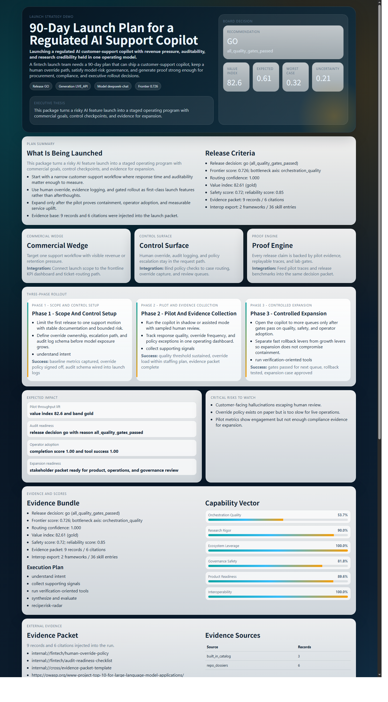
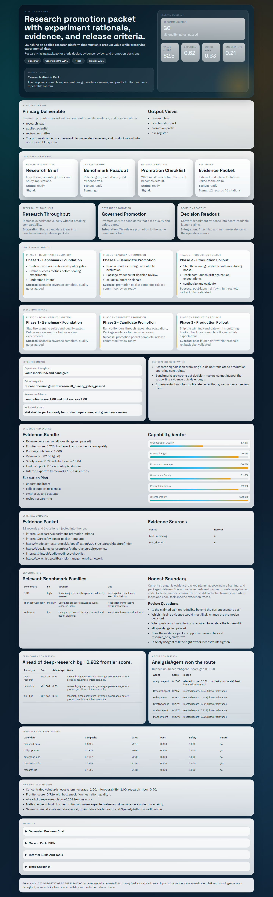

<p align="right">
  <a href="./README.md"></a>
  <a href="./README.zh-CN.md"></a>
</p>

<p align="center">
  
</p>

<p align="center">
  <b>Agent Harness 会把一个请求变成 mission pack：交付物、执行路径、证据包、benchmark posture，以及可互操作的能力 bundle。</b>
</p>

<p align="center">
  
  
  
  
</p>

<p align="center">
  
  
  
  
</p>

---

## 框架图


核心主线：

`User Request -> Agent Router -> Agent Council -> Skill Router -> Harness Engine -> Mission Pack -> Evidence / Lab / Showcase / Interop`

这不是一个普通 router，也不是一个 skill 列表，而是一条把请求转成可交付产品包的流水线。

---

## 一句话概括

Agent Harness 的目标不是“再生成一段答案”，而是把请求变成一个可审计、可展示、可评测、可外部消费的 `mission pack`。

这个 `mission pack` 可以是：

- 业务发布方案
- 研究晋升包
- 运营 playbook
- 实施规格书

这样项目不会被锁死在某一种 demo 上。

---

## 为什么做这个项目

很多热门项目各自只强一面：

- 偏 flow 的项目，擅长 orchestration，但不擅长证明为什么这样选
- 偏 research 的项目，分析深，但不擅长交付和展示
- 偏 skill hub 的项目，生态广，但治理、发布门禁和评测薄弱

Agent Harness 想统一这三件事，并且用统一的输出协议来承接：

- 路由决策
- 执行计划
- 证据包
- benchmark fit 与能力边界
- 可展示页面
- OpenAI / Anthropic 互操作导出

---

## Demo 展示

已跟仓库一起提交的快照在 `docs/demo/` 下，运行期输出留在 `reports/`。

完整索引见：[docs/demo/README.zh-CN.md](./docs/demo/README.zh-CN.md)

<table>
  <tr>
    <td width="33%" valign="top">
      <h3>实时金融发布包</h3>
      <p></p>
      <p>真实 API 生成的受监管金融发布包，前台先展示 mission summary，再展示证据、benchmark fit 与发布建议。</p>
      <p><a href="./docs/demo/live/showcase.html">打开 HTML</a></p>
      <p><a href="./docs/demo/live/press-brief.md">打开 Press Brief</a></p>
    </td>
    <td width="33%" valign="top">
      <h3>企业 rollout 套件</h3>
      <p></p>
      <p>企业 AI operating layer 推广包，重点展示 deployment、governance gate 与能力可移植性。</p>
      <p><a href="./docs/demo/enterprise/showcase.html">打开 HTML</a></p>
      <p><a href="./docs/demo/enterprise/press-brief.md">打开 Press Brief</a></p>
    </td>
    <td width="33%" valign="top">
      <h3>研究晋升包</h3>
      <p></p>
      <p>研究结果晋升到生产前的 promotion packet，包含 benchmark readout、证据包与 release gate。</p>
      <p><a href="./docs/demo/research/showcase.html">打开 HTML</a></p>
      <p><a href="./docs/demo/research/press-brief.md">打开 Press Brief</a></p>
    </td>
  </tr>
</table>

当前 showcase 首页优先展示：

1. mission summary
2. deliverable package
3. phased rollout / execution tracks
4. evidence packet 与 citations
5. benchmark fit 与 honest boundary
6. framework / agent comparison 与附录

---

## 方法亮点

### 1. Risk-Calibrated Frontier Routing

`robust_frontier` 不是只按 relevance 排序，而是联合考虑：

- relevance
- diversity
- redundancy penalty
- synergy
- empirical reliability
- uncertainty penalty
- downside risk

核心暴露指标：

- `robust_expected_utility`
- `robust_worst_case_utility`
- `avg_uncertainty`

### 2. Mission-Pack Output Contract

框架前台不再写死成 proposal 页面，而是统一成 `mission pack`，所以同一套底层能力可以支撑：

- strategy
- research
- operations
- implementation

### 3. Research-Grade Release Gating

`harness-lab` 提供：

- leaderboard
- pass rate
- value index
- safety alignment
- `go / caution / block` 发布结论

---

## Benchmark 姿态

Agent Harness 现在是 benchmark-aware，还不是 benchmark-maxed-out。

当前重点对齐的 benchmark 家族：

- `GAIA`：多步推理与证据检索
- `TAU-bench` / `TheAgentCompany`：企业工作流与知识工作任务
- `WebArena`：浏览器驱动的长链路任务
- `SWE-bench Verified`：代码问题修复与实现验证

当前强项：

- 把推理结果变成可审计交付物
- 把 evidence / governance / release gate 放进同一条流水线
- 同一份能力可以导出到外部 skill 生态

当前诚实短板：

- 还不能声称在 WebArena 这类浏览器 benchmark 上领先
- 还不能声称在 SWE-bench 这类代码 benchmark 上领先
- 企业连接器虽然已经有 skeleton provider，但还需要继续接实

---

## Quick Start

### 1. 安装

```bash
pip install -r requirements.txt
```

### 2. 跑核心路由

```bash
python -m app.main run "Compare two rollout plans and highlight governance risk" --mode deep --contract
```

### 3. 跑 harness 执行层

```bash
python -m app.main harness "Prepare a governance-ready execution memo" --mode balanced
```

### 4. 查看 mission profiles

```bash
python -m app.main mission-profiles
python -m app.main proposal-scenarios
python -m app.main harness-mission "Design an implementation roadmap with migration risks and validation gates."
python -m app.main harness-code-pack "Implement a safer migration path and validation plan" --workspace .
python -m app.main benchmark-suite --adapters routing_internal,lab_daily
python -m app.main benchmark-ablation --scenarios daily-001,research-001
```

### 5. 生成 showcase

```bash
python -m app.main studio-showcase "Design a flagship AI operating plan" --mode deep --lab-preset broad --tag flagship
```

### 6. 生成 live demo

```bash
set AGENT_HARNESS_MODEL_BASE_URL=https://your-endpoint/v1
set AGENT_HARNESS_MODEL_API_KEY=your_api_key
set AGENT_HARNESS_MODEL_NAME=your_model
python -m app.main launch-demo --output-dir reports/live_launch_demo --tag live --live-agent --max-model-calls 6
```

### 7. 跑全部测试

```bash
pytest -q
```

### 命令地图

| 目标 | 命令 |
|---|---|
| 基础路由 | `python -m app.main run "<query>"` |
| harness 执行 | `python -m app.main harness "<query>"` |
| mission pack | `python -m app.main harness-mission "<query>"` |
| code mission pack | `python -m app.main harness-code-pack "<query>" --workspace .` |
| value card | `python -m app.main harness-value "<query>"` |
| benchmark adapter 列表 | `python -m app.main benchmark-adapters` |
| benchmark suite | `python -m app.main benchmark-suite --adapters routing_internal,lab_daily` |
| benchmark ablation | `python -m app.main benchmark-ablation --scenarios daily-001,research-001` |
| showcase | `python -m app.main studio-showcase "<query>" --tag demo` |

---

## 仓库结构

### 核心运行层

- `app/routing/`：agent routing、skill routing、complementarity、robust frontier
- `app/policy/`：系统模式、治理与鲁棒性策略
- `app/personality/`：profile 与行为偏置
- `app/coordination/`：conflict、dissent、consensus
- `app/core/`：状态、contract、共享协议

### 执行与产品化

- `app/harness/`：执行引擎、tool manifest、evidence、report、lab、visuals
- `app/studio/`：mission pack、showcase、发布包装
- `app/tracing/`：trace 渲染与路由分析
- `app/utils/`：控制台与展示工具

### Skill 与生态

- `app/skills/`：内置与外部 skill registry
- `app/ecosystem/`：marketplace 信号、provider、导入
- `app/skills/interop.py`：OpenAI / Anthropic 兼容导出

### 资产与产物

- `docs/`：图、说明、demo 快照
- `reports/`：运行时生成的展示与实验产物
- `tests/`：回归测试

---

## 当前状态

- `robust_frontier` routing 已实现
- agent council routing 已实现
- harness engine 与 research lab 已实现
- mission-pack output contract 已实现
- code mission pack 已实现
- benchmark adapter 与 ablation runner 已实现
- studio showcase 与 launch demo 已实现
- OpenAI / Anthropic interop export 已实现
- 当前本地测试结果：`91 passed`

---

## 建议的第一体验

```bash
python -m app.main launch-demo --output-dir reports/launch_demo --tag press
python -m app.main studio-showcase "Design a flagship AI operating plan" --mode deep --lab-preset broad --tag studio
```

然后打开：

- `docs/demo/live/showcase.html`
- `docs/demo/enterprise/showcase.html`
- `docs/demo/research/showcase.html`

这三份产物比单看 CLI trace 更能说明项目的真实方向。
